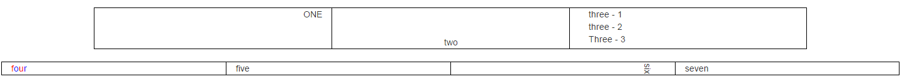

# UI Styling Challenge - Part 2

Using Bootstrap 3.3.7, recreate the following:

* Using only classes, no element ID’s.
* You may not use more than 1 custom class.
* You may not use the style property in the HTML elements.
* Table-less design.
* All text in the HTML must be lower case.  i.e. one, two, three, etc.
* 100% width.
